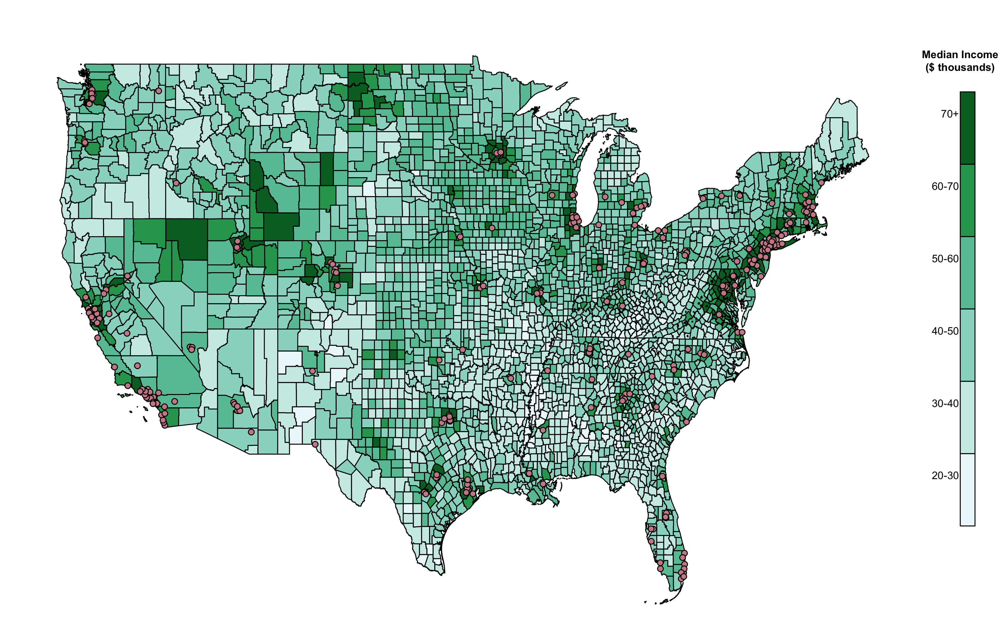

# apple_stores

## About
This repository contains code to scrape, parse, and map the location of US apple stores.

### Content
`python/`: Contains code to create scrape and parse the location of US apple stores

`R/`: Contains code to create map

`data/`: Contains apple store location and county-level household income data

`figures/`: Contains map

`shapefile/`: Contains county-level map of US

